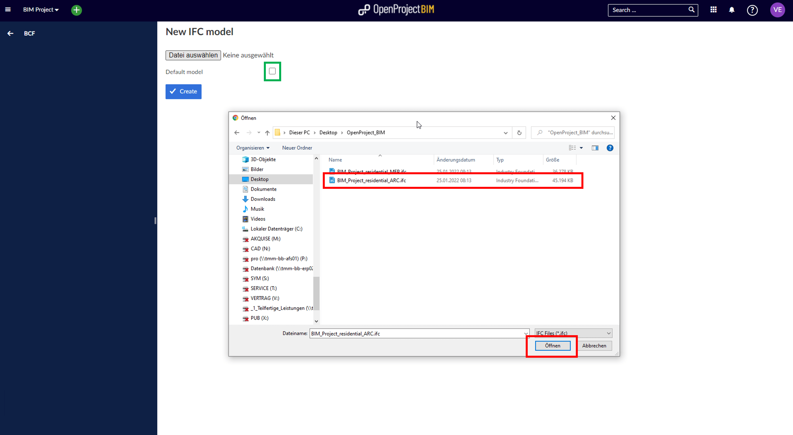
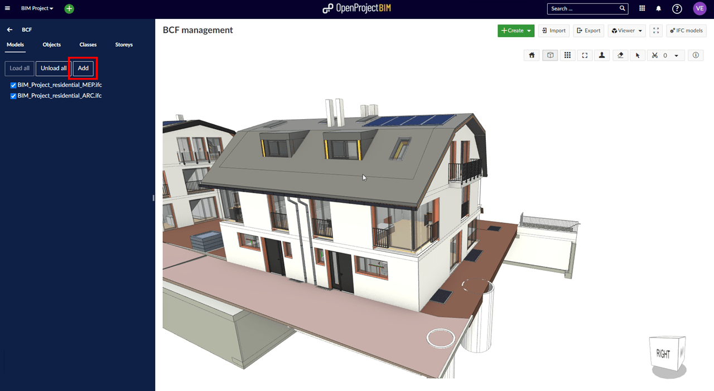
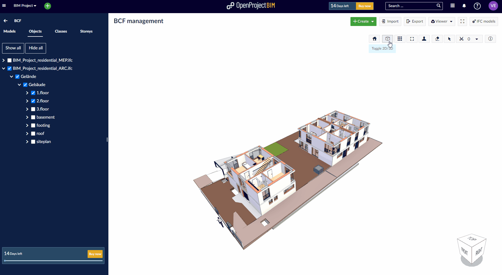
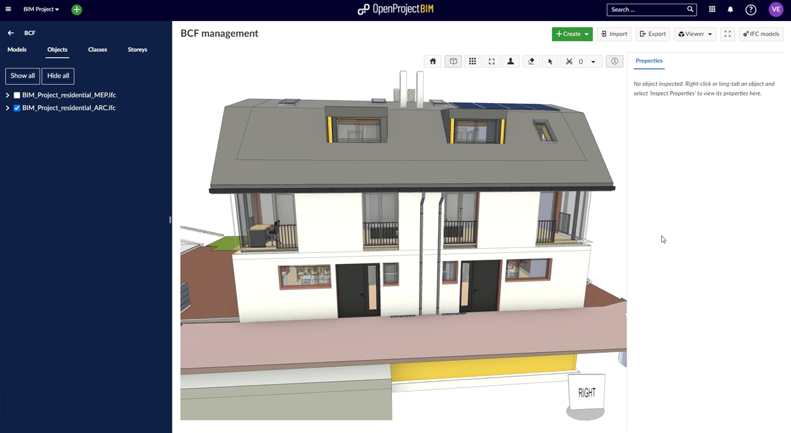
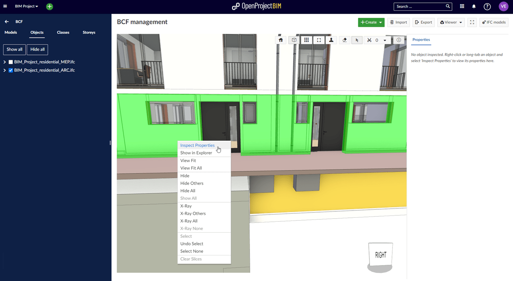
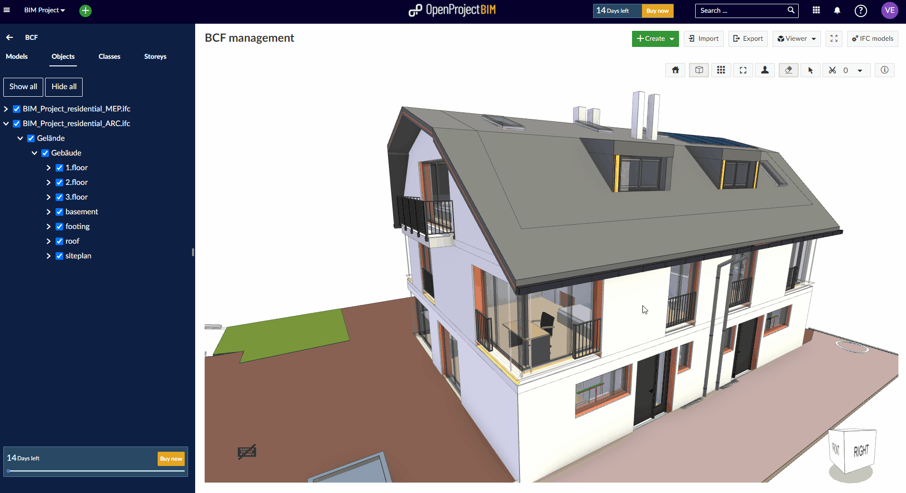

---
sidebar_navigation:
  title: IFC viewer
  priority: 300
description: How to use the OpenProject IFC-Viewer.
keywords: BIM, BCF, IFC, Viewer
---

# IFC viewer (BIM feature)

OpenProject BIM includes a very powerful IFC viewer to show and interact with building models in 2D & 3D.

IFC-Files can be uploaded and shown directly within your Web-Browser without installing any additional software on your computer.

## Basics

The BCF Module has included a very powerful IFC viewer. Here is a short overview of available user actions:

1. **IFC Model Viewer** to have a look at the building model directly within OpenProject BIM.
2. **IFC Model Tree** to see the IFC Model Structure and show / hide elements.
3. The **OpenProject toolbar** shows the most important user actions like creating new (BIM) issues, Import & Export BCF files, Change OpenProject View and upload & download IFC-Models
4. The **View Cube** to rotate the building model.
5. The **IFC-Viewer toolbar** to interact with the building model (e.g. change perspective, hide/ show elements, select elements & slice the building model)

## Import and export IFC models

Within the BCF module you are able to manage your IFC files. You are able to upload new building models and download already existing files. Just Click on the ***"IFC-Models"-Button*** within the OpenProject Toolbar.

To upload your first IFC model click on the green "+ IFC Model" - Button. A new explorer Window will be opened. Just navigate to the folder where your latest building model is saved.

Select the file you want and confirm your upload. You also the choice to set the new model as "Default model". All default models (multiple models can be set as default) are initially shown if you reload the BCF module. You are able to change this setting later as well.

After uploading a building model you get an overview of all models within the "model management". There you are able to see their current upload status, rename the model, delete or download the existing models.

If there already exist a model in project, you don't have to open the "model manager" to upload other models. You are able to add more models by clicking the "Add-Button" in the IFC Model Tree.  

**Remember:** If there are multiple models you are able to hide the whole model or single elements by using the checkbox within model tree.  

## How to rotate the building model

To rotate the IFC model you either left-click on the building viewer and ***rotate the building model by panning*** your cursor **or** use the ***View Cube*** in the right bottom corner for navigation.

## IFC-viewer toolbar

The IFC-Viewer toolbar has many functions which are described below. The user actions all relate to the viewer and can be started by clicking on the button.

### Reset view

If your building model (or objects within the model) is rotated, zoomed or cut and you want to reset your current view this function will help you. All you have to do is press the button once and your your view will be reset to the default.

### 2D / 3D view

If your building model can easily be shown in 2D or 3D. This function is very popular to have a deeper look into the building (e.g. to see the floor plan). To use this function in the best way, you are able to combine the 2D view with hiding elements (like it is shown below).

### Orthographic view

The default behavior of the OpenProject BIM Model Viewer is a perspective view. The perspective camera gives you more information about depth. Distant objects are smaller than nearby ones. This function changes from perspective view to orthographic view.  The orthographic view is widely used in engineering. All objects appear at the same scale and parallel lines remain parallel. Also a unit length appears the same length anywhere on the screen. This makes it easier to assess the relative sizes.

### Fit view

This function allows you to reset the current zoom level and the position of the building model. The button resets the zoom and position of the building model so that the entire model is visible and centered.

### First person perspective

The first person perspective changes the way you interact with the building model. The user no longer rotates the entire building model around an axis. Now he has the option of changing their own perspective. After activating the first person perspective, the viewer behaves similar to the real world and the camera moves in a manner comparable to a head movement.

## How to slice the building model

To have a deeper look within the building model you are able to slice the whole building. To start slicing click on the "***scissors symbol***" within the ***IFC-Viewer toolbar*** and left-click on an element which has the same angle you want to slice (you can edit this angle later as well). Now there are shown some arrows. Grab one and slice the model by dragging the arrow to the location you want.

## How to clear slices

You are able to clear all slices by using the ***dropdown*** menu next to the "***scissors symbol***" within the ***IFC-Viewer-Toolbar***.

## How to select elements

To select elements within the building model, you have to activate the selection mode by clicking on the highlighted toggle button placed in the ***IFC-Viewer toolbar***. After activating the selection mode you are able to select a single or multiple elements within the viewer by left click. Your individual selection won't be reset after leaving the selection mode. You are able to reset your current selection with the context menu (right click).

## Show properties

You are able to see the basic properties of each element (e.g. the UUID) within OpenProject BIM. After using the "information" button a new tab named "Properties" will appear.

In order to inspect the information for individual objects, you have to use the context menu and simply select the "Inspect Properties" Menu item. All properties of the object will appear in the new tab.

**But be careful!** The properties of the element you just clicked on are displayed. So make sure that there are no unwanted objects (e.g. window panes) in front of your desired object.

## Show or hide elements via viewer

There are two options to hide elements via viewer. The **first possibility** is to use the ***IFC-viewer toolbar***. Within the toolbar you will find the **"hide-button"**

After the "Hide-Mode" has been activated, each element you click (left click) on will be hidden.

The **second possibility** to hide single elements via viewer is to use the context menu. Here you can find the function to hide single elements.

You are always able to show hidden elements by using the **"Reset-View" Button** in the Viewer toolbar or use the **"Show All"** **Button** in the IFC Model tree.

Sometimes it is helpful to see elements in context to other elements but a good view can be disturbed by individual elements. For this case our viewer is able to show your building model in an "X-Ray"-Mode. The mode can be activated via the context menu and enables disturbing elements to be displayed in the context of other elements without covering them.

## Show elements in model tree

To be sure if you hide or select the element you want you are able to jump to this element in the IFC Model tree.

All you have to do is open the context menu on the desired element and select the "Show in Explorer" function. Now the Model tree folds out to the desired element.

## Show or hide models or elements via model tree

If you have uploaded several IFC models of one building (e.g. one for each discipline - Architecture, Structural & MEP) and want to have a look at a single model or just want to hide specific elements, you are able to hide them by changing the status of the ***checkbox within the model tree.***

The model tree can represent the structure of the building model in different ways. This means that entire models, storeys or even similar components can be hidden with a single click.

After switching to the "Classes" tab in the model tree, you can see the grouping of all elements by IFC classification. Whole groups can be hidden as well. In the example, all elements of the type "IFCWall" will be hidden.  

